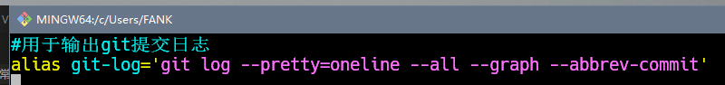
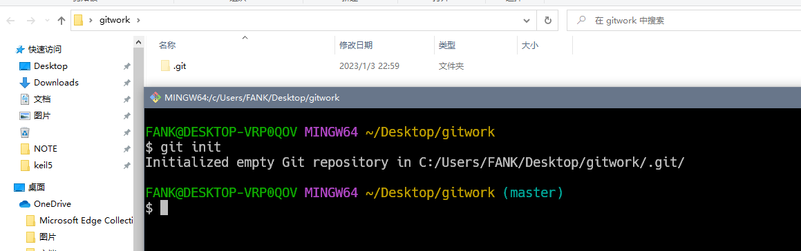
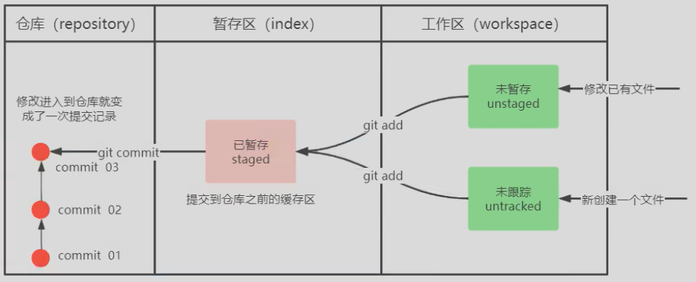
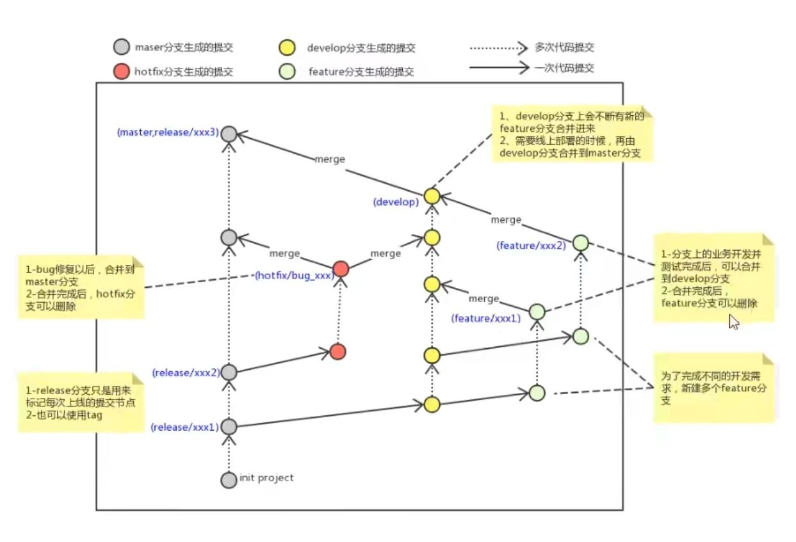
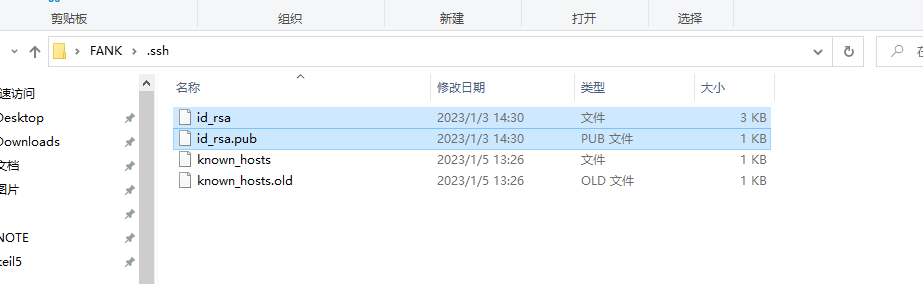

---
html:
  embed_local_images: true
  embed_svg: true
  offline: false
  toc: true

print_background: false
---

# Git学习笔记
- [Git学习笔记](#git学习笔记)
  - [1 概述](#1-概述)
  - [2 Git常用命令](#2-git常用命令)
    - [2.1 Git环境配置](#21-git环境配置)
      - [2.1.1 基本配置](#211-基本配置)
      - [2.1.2 为常用指令配置别名](#212-为常用指令配置别名)
    - [2.2 创建一个*本地仓库*（*repository*）](#22-创建一个本地仓库repository)
    - [2.3 基础操作指令](#23-基础操作指令)
    - [2.3.1 查看修改的状态(status)](#231-查看修改的状态status)
    - [2.3.2 将工作区内容添加到暂存区(add)](#232-将工作区内容添加到暂存区add)
    - [2.3.3 提交暂存区到本地仓库（commit）](#233-提交暂存区到本地仓库commit)
    - [2.3.4 查看提交日志（log）](#234-查看提交日志log)
    - [2.3.5 版本回退(reset)](#235-版本回退reset)
    - [2.3.6 添加文件至忽略列表](#236-添加文件至忽略列表)
  - [2.3 分支](#23-分支)
    - [2.3.1 分支的基本操作](#231-分支的基本操作)
    - [2.3.4 合并分支(merge)](#234-合并分支merge)
    - [2.3.5 解决冲突](#235-解决冲突)
- [3 Git远程仓库](#3-git远程仓库)
  - [3.1 配置SSH密钥](#31-配置ssh密钥)
  - [3.2 创建一个本地与远程有关联的仓库](#32-创建一个本地与远程有关联的仓库)
    - [3.2.1 将本地仓库与远程仓库相关联并推送](#321-将本地仓库与远程仓库相关联并推送)
    - [3.2.2 将远程仓库下载到本地](#322-将远程仓库下载到本地)
  - [3.3 从远仓库更新文件到本地（下载更新到本地）](#33-从远仓库更新文件到本地下载更新到本地)
    - [3.3.1 拉取到本地并合并](#331-拉取到本地并合并)
    - [3.3.2 下载最新的更新到本地并以新的分支保存](#332-下载最新的更新到本地并以新的分支保存)
  - [3.2 从远仓库更新文件到本地（推送更改到远程仓库）](#32-从远仓库更新文件到本地推送更改到远程仓库)

## 1 概述  
Git 的工作就是创建和保存你项目的快照及与之后的快照进行对比。

说明：
- workspace：工作区
- staging area：暂存区/缓存区
- local repository：版本库或本地仓库
- remote repository：远程仓库
## 2 Git常用命令  
### 2.1 Git环境配置  
#### 2.1.1 基本配置  
1）打开Git Bash  
2）设置用户信息

```
git config --global user.name "yourname" 
git config --global user.email "your email" 
```
如果需要查看用户信息则输入下面的指令 ：  
````
**git config --global user.name "yourname"**    
**git config --global user.email "your email"**
````


#### 2.1.2 为常用指令配置别名
有些指令使用频繁，但是指令非常长，我们可以给这些指令设置别名：  
1）打开用户目录，**在目录下**GitBash执行`touch ~/.bashrc`
2）在`.bashrc`文件中输入`alias 设置的快捷指令='原指令' `  

如：



### 2.2 创建一个*本地仓库*（*repository*）
 要使用Git对项目进行版本控制，我们需要先使用`git init`初始化。  
 1）在项目目录下打开GitBash   
 2）执行命令`git init`

此时在该目录下会出现隐藏的`.git`目录


### 2.3 基础操作指令
Git工作目录下对文件的**修改**（增加、删除、更新）会存在几个状态，这些**修改**的状态会随着我们执行Git命令而发生变化。

  

<br>:star:
### 2.3.1 查看修改的状态(status)
- 作用：查看*工作区*（*workspace*）或者*暂存区*(*index*)的状态。

- 命令形式：`git status`  

<br>:star:
### 2.3.2 将工作区内容添加到暂存区(add)
- 作用：添加工作区一个或者多个文件的修改到暂存区。
- 命令形式：`git add 单个文件名|通配符`
    - 将所有修改加入暂存区：`git add .`
    - 若需要取消git对某些文件或者文件夹更改的跟踪，需要在项目目录下新建`.gitignore`文件，并写入需要取消跟踪的文件的相对路径（详细内容见[2.3.6 添加文件至忽略列表](#236-添加文件至忽略列表)）。
### 2.3.3 提交暂存区到本地仓库（commit）
- 作用：提交暂存区内容到本地仓库的当前分支
- 命令形式：`git commit -m "注释内容"`

>如果注释内容编写错误，需要更改，可以使用指令**git commit --amend**  

<br>:star:
### 2.3.4 查看提交日志（log）
- 作用：查看提交记录。
- 命令形式：`git log [option]`
    - options
        - `--all` 显示所有分支
        - `--pretty=ontline` 将提交信息显示为一行
        - `--graph` 以图的形式显示
>  :monkey::在2.1.2 为常用指令配置别名`**git-log**就包含了这个参数，所以后续可以直接使用指令**git-log**替代


### 2.3.5 版本回退(reset)
- 作用：回退版本，可以指定退回某一次提交的版本。
- 命令形式：`git reset --hard commitID`
    commitID可以用`git-log`或者`git log`指令查看
>如果要查看已经删除的记录，可以使用`git reflog`

### 2.3.6 添加文件至忽略列表
在绝大部分情况下，并不想有些文件被跟踪，这时可以在git托管的目录下创建文件`.gitignore`，并在文件中写入不想被跟踪的文件的相对路径。

## 2.3 分支
开发中分支的使用原则与流程：

### 2.3.1 分支的基本操作
- 查看本地分支：`git branch`
- 创建本地分支：`git branch 分支名 `   
- 切换分支：`git checout 分支名`
  - *我们可以创建一个分支并切换到该分支：`git checkout -b 分支名`*
- 删除分支：
  :monkey::**不能删除当前分支，只能删除其他分支**
  `git branch -d 分支名` （删除分支时需要做各种检查）  
  `git branch -D 分支名`（删除分支时不需要做各种检查）

### 2.3.4 合并分支(merge)
当一个分支的工作完成后，需要合并到主分支上去。
假设当前分支B需要合并到主分支A上去，则：
1）使用`checkout`命令切换到分支A
2）使用命令`git merge B`

### 2.3.5 解决冲突
当两个分支上对文件的修改可能会存在冲突。例如修改了同一个文件的同一行，使用`merge`命令就会失败,这时就需要动手解决冲突：
1）处理文件中冲突的地方
2）将解决完冲突的文件加入暂存区（add）
3）提交到仓库

# 3 Git远程仓库
## 3.1 配置SSH密钥  
>SSH (Secure Shell) 是一种安全的远程登录协议，可以让你通过安全的加密连接进行远程登录。如果你想通过 SSH 连接到 Github，首先需要创建一对 SSH 密钥（即公钥和私钥），然后将公钥上传到 Github。现在的代码管理平台例如github、gitliab支持http协议或者ssh协议。HTTPS利于匿名访问，适合开源项目可以方便被别人克隆和读取(但没有push权限)；而SSH协议使用公钥认证比较适合内部项目。

在了解之前，先注册github账号，由于你的本地Git仓库和github仓库之间的传输是通过SSH加密的，所以需要一点设置：
1）创建SSH Key。在用户主目录下，打开命令行，输入命令：`ssh-keygen -t rsa –C “youremail@example.com”`  
  
运行后，该目录下会生成一个`.ssh`文件，id_rsa是私钥，不能泄露出去，id_rsa.pub是公钥，可以放心地告诉任何人。
2）登录github,打开左上角`settings`中的SSH Keys页面，然后点击`Add SSH Key`”,填上任意title，在Key文本框里黏贴`id_rsa.pub`文件的内容。
## 3.2 创建一个本地与远程有关联的仓库
### 3.2.1 将本地仓库与远程仓库相关联并推送
1）使用`init`命令初始化本地仓库。
2）将文件commit到本地仓库
3）增加远程仓库源：`git remote add origin SSH`
- 指令中`origin`是自定的，一般情况下均规范为origin
- `SSH`远程仓库的地址
### 3.2.2 将远程仓库下载到本地
## 3.3 从远仓库更新文件到本地（下载更新到本地）
### 3.3.1 拉取到本地并合并
### 3.3.2 下载最新的更新到本地并以新的分支保存
## 3.2 从远仓库更新文件到本地（推送更改到远程仓库）


